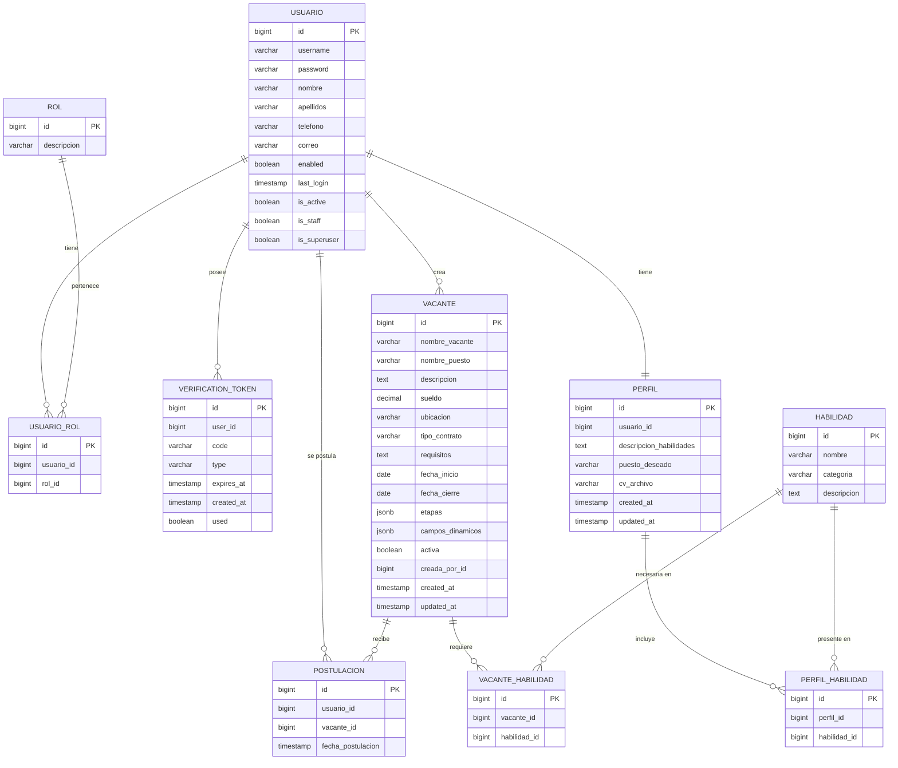

# Diagrama Relacional — RecSystem (Liver Talent)



## Leyenda

| Tabla | Descripción |
|---|---|
| `usuario` | Usuarios del sistema (reclutadores, aspirantes, admin) |
| `rol` | Catálogo de roles: `ROLE_RECLUTADOR`, `ROLE_ASPIRANTE`, `ROLE_ADMIN` |
| `usuario_rol` | Tabla pivote que relaciona usuarios con roles (M:N) |
| `verification_token` | Tokens de verificación auth2fa (registro, cambio de contraseña) |
| `vacante` | Vacantes de trabajo publicadas por reclutadores |
| `postulacion` | Postulaciones de aspirantes a vacantes |
| `perfil` | Perfil del aspirante (descripción, puesto deseado, CV) — 1:1 con usuario |
| `habilidad` | Catálogo de habilidades (nombre, categoría) |
| `perfil_habilidad` | M:N — conecta un perfil con las habilidades que posee |
| `vacante_habilidad` | M:N — conecta una vacante con las habilidades que requiere |

## Relaciones detalladas

### 1. Usuario ↔ Rol (Muchos a Muchos vía `usuario_rol`)

Un **usuario** puede tener **muchos roles** (ej. alguien puede ser `ROLE_RECLUTADOR` y `ROLE_ADMIN` a la vez).  
Un **rol** puede pertenecer a **muchos usuarios** (ej. varios reclutadores comparten `ROLE_RECLUTADOR`).

```
usuario.id ──→ usuario_rol.usuario_id
rol.id     ──→ usuario_rol.rol_id
```

**¿Por qué una tabla pivote?**  
Django necesita una tabla intermedia para relaciones M:N. `usuario_rol` almacena cada par (usuario, rol). La constraint UNIQUE(usuario_id, rol_id) evita que un usuario tenga el mismo rol asignado dos veces.

**En código (models.py):**
```python
class Usuario(models.Model):
    roles = models.ManyToManyField('Rol', through='UsuarioRol')
```

### 2. Usuario → VerificationToken (Uno a Muchos)

Un **usuario** puede tener **muchos tokens de verificación** (uno por cada intento de registro o cambio de contraseña).  
Cada **token** pertenece a **un solo usuario**.

```
usuario.id ──→ verification_token.user_id
```

**¿Por qué?**  
Cada vez que alguien solicita un código (registro, forgot-password), se crea un nuevo `VerificationToken` asociado a su usuario. Los tokens expiran y se marcan como usados, pero se conservan en BD para auditoría.

### 3. Usuario → Vacante (Uno a Muchos)

Un **usuario con rol RECLUTADOR** puede crear **muchas vacantes**.  
Cada **vacante** es creada por **un solo usuario**.

```
usuario.id ──→ vacante.creada_por_id
```

**¿Por qué?**  
Se necesita saber qué reclutador publicó cada vacante. La FK apunta a `usuario(id)`.

### 4. Vacante ↔ Usuario (Muchos a Muchos vía `postulacion`)

Un **aspirante** puede postularse a **muchas vacantes**.  
Una **vacante** puede recibir postulaciones de **muchos aspirantes**.

```
usuario.id   ──→ postulacion.usuario_id
vacante.id   ──→ postulacion.vacante_id
```

**¿Por qué una tabla pivote?**  
La relación entre aspirantes y vacantes es M:N. `postulacion` almacena cada postulación con su fecha. La constraint UNIQUE(usuario_id, vacante_id) garantiza que un aspirante no se postule dos veces a la misma vacante.

### 5. Usuario → Perfil (Uno a Uno)

Un **usuario** (con rol ASPIRANTE) tiene **un solo perfil**.  
Un **perfil** pertenece a **un solo usuario**.

```
usuario.id ──→ perfil.usuario_id (UNIQUE)
```

**¿Por qué 1:1 y no meter los campos en Usuario?**  
Separar `perfil` mantiene el modelo `Usuario` enfocado en autenticación. Los datos de perfil (CV, habilidades, puesto deseado) son opcionales y propios del módulo de reclutamiento, no del core de auth.

### 6. Perfil ↔ Habilidad (Muchos a Muchos vía `perfil_habilidad`)

Un **perfil** puede listar **muchas habilidades**.  
Una **habilidad** puede estar en **muchos perfiles**.

```
perfil.id   ──→ perfil_habilidad.perfil_id
habilidad.id ──→ perfil_habilidad.habilidad_id
```

**¿Por qué una tabla pivote?**  
Las habilidades se seleccionan de un catálogo (`habilidad`). Si fuera un campo de texto, no se podría hacer match contra las vacantes. Al ser M:N con catálogo, el sistema puede responder: "esta vacante necesita Python y SQL → ¿qué aspirantes tienen Python y SQL en su perfil?".

### 7. Vacante ↔ Habilidad (Muchos a Muchos vía `vacante_habilidad`)

Una **vacante** puede requerir **muchas habilidades**.  
Una **habilidad** puede ser requerida por **muchas vacantes**.

```
vacante.id   ──→ vacante_habilidad.vacante_id
habilidad.id ──→ vacante_habilidad.habilidad_id
```

**¿Para qué sirve?**  
Hace posible el **match aspirante ↔ vacante**. El reclutador define las habilidades requeridas al crear la vacante. Cuando un aspirante se postula (o busca vacantes), el sistema puede calcular un % de compatibilidad basado en las habilidades que coinciden.

### 8. Resumen gráfico de cardinalidades

```
USUARIO ──1── USUARIO_ROL ──*── ROL
USUARIO ──1── VERIFICATION_TOKEN (1:N)
USUARIO ──1── VACANTE (reclutador crea)
USUARIO ──*── POSTULACION ──*── VACANTE (aspirante se postula)
USUARIO ──1── PERFIL (1:1)
PERFIL  ──*── PERFIL_HABILIDAD ──*── HABILIDAD
VACANTE ──*── VACANTE_HABILIDAD ──*── HABILIDAD
```

## Constraints

- `usuario_rol`: UNIQUE(usuario_id, rol_id)
- `verification_token`: usado para flujo auth2fa, se marca `used=true` tras validación
- `vacante.creada_por_id` → FK a `usuario(id)` (reclutador que la creó)
- `postulacion`: UNIQUE(usuario_id, vacante_id) — un aspirante no puede postularse dos veces a la misma vacante
- `vacante.activa`: default TRUE, el reclutador puede desactivarla sin borrar datos
- `vacante.etapas`: JSONB — array de strings, ej. `["Revisión CV", "Entrevista", "Prueba técnica"]`
- `vacante.campos_dinamicos`: JSONB — array de objetos, ej. `[{"nombre": "Idioma", "valor": "Inglés C1"}]`
- `perfil.usuario_id`: UNIQUE — un usuario tiene exactamente un perfil
- `perfil_habilidad`: UNIQUE(perfil_id, habilidad_id) — una habilidad no se repite en el mismo perfil
- `vacante_habilidad`: UNIQUE(vacante_id, habilidad_id) — una habilidad no se repite en la misma vacante
- `habilidad.nombre`: UNIQUE — catálogo sin duplicados
